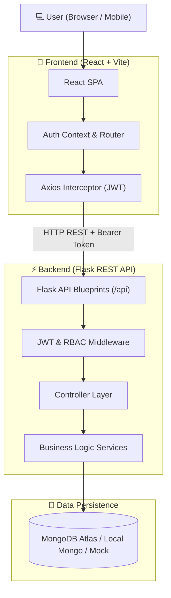

# 🎓 Hostel Gatepass Management System

A production-ready, full-stack digital web application for hostel gatepass management built with **Flask**, **PyMongo (MongoDB)**, **JWT Authentication**, **Role-Based Access Control (RBAC)**, and a modern **React + Vite** Single Page Application.

---

## 🌟 Overview & Key Features

The Hostel Gatepass Management System automates the complete lifecycle of hostel student gatepasses—from application and warden approval to security desk verification, real-time check-out, and check-in tracking.

### 🔐 Multi-Role Access Control (RBAC)
- 🎓 **Student Portal**: Apply for gatepasses with date validation, track request status (`Pending`, `Approved`, `Rejected`, `Cancelled`, `Checked Out`, `Checked In`), and cancel pending requests.
- 🛡️ **Warden Dashboard**: Review pending requests, inspect student room details and leave reasons, and approve or reject passes with remarks.
- 👮 **Security Guard Desk**: Search and verify approved student passes, perform one-click **Check-Out** when students leave, and **Check-In** when students return with real-time audit logging.
- 👑 **Admin Control Center**: Monitor system-wide statistics, manage user accounts, assign roles dynamically, and configure hostel capacities.

---

## 📐 System Architecture



---

## 📁 Repository Structure

```
HostelGatepassManagementSystem/
├── backend/                        # Flask REST API Server
│   ├── app.py                      # Application entry point & Blueprint registration
│   ├── requirements.txt            # Python dependencies (Flask, PyMongo, PyJWT, bcrypt, pytest)
│   ├── .env.example                # Backend environment template
│   ├── config/                     # Database & settings configuration
│   │   ├── database.py             # PyMongo client & fallback handler
│   │   └── settings.py             # Environment configuration manager
│   ├── controllers/                # Request validation & HTTP response handling
│   │   ├── admin_controller.py
│   │   ├── auth_controller.py
│   │   ├── gatepass_controller.py
│   │   └── student_controller.py
│   ├── middleware/                 # Security decorators
│   │   ├── auth.py                 # JWT Token validation decorator
│   │   ├── error_handler.py        # Global error handlers
│   │   └── roles.py                # Role-Based Access Control (RBAC) decorator
│   ├── models/                     # Mongo schema builders & data constants
│   │   ├── gatepass.py
│   │   ├── hostel.py
│   │   ├── student.py
│   │   └── user.py
│   ├── routes/                     # REST API Blueprints
│   │   ├── admin_routes.py         # Admin management endpoints
│   │   ├── auth_routes.py          # Register, Login, Me endpoints
│   │   ├── gatepass_routes.py      # Apply, Approve, Reject, Check-Out, Check-In
│   │   └── student_routes.py       # Student profile & history endpoints
│   ├── services/                   # Core business logic layer
│   │   ├── auth_service.py
│   │   └── gatepass_service.py
│   ├── utils/                      # Helper modules
│   │   ├── helpers.py              # JWT generation, password hashing, document serialization
│   │   ├── response.py             # Standardized API response formatters
│   │   └── validators.py           # Input payload validation functions
│   └── tests/                      # Pytest unit & integration test suite
│       ├── conftest.py             # Pytest fixtures & database teardown
│       ├── test_admin.py
│       ├── test_auth.py
│       ├── test_gatepass.py
│       ├── test_security.py
│       └── test_student.py
│
└── frontend/                       # React SPA (Vite)
    ├── package.json                # Frontend dependencies
    ├── vite.config.js              # Vite server & dev proxy config
    ├── index.html                  # HTML entry point
    └── src/
        ├── api/
        │   └── axiosClient.js      # Axios instance with automatic JWT Authorization header
        ├── components/             # Reusable UI components
        │   ├── GatepassCard.jsx
        │   ├── Navbar.jsx
        │   ├── ProtectedRoute.jsx
        │   ├── StatCard.jsx
        │   └── Toast.jsx
        ├── context/
        │   └── AuthContext.jsx     # Global Authentication State
        ├── pages/                  # Application views
        │   ├── AdminDashboard.jsx  # Admin Metrics & User Role Manager
        │   ├── Login.jsx           # Sign In & Registration Portal
        │   ├── NotFound.jsx        # 404 Route Fallback
        │   ├── Profile.jsx         # User Profile & Password Change
        │   ├── SecurityDashboard.jsx # Security Guard Gate Check-In / Check-Out
        │   ├── StudentDashboard.jsx  # Student Application & History View
        │   └── WardenDashboard.jsx # Warden Approval & Rejection Console
        ├── App.jsx                 # Route definitions & Dashboard redirect logic
        ├── main.jsx                # React DOM render entry
        └── index.css               # Modern Glassmorphism CSS Design System
```

---

## 🚀 Quick Start & Setup Guide for New Users

Follow these steps to set up and run the application on your local machine.

### Prerequisites
- **Python** (version 3.10 or higher)
- **Node.js** (version 18 or higher) & **npm**
- **MongoDB** (MongoDB Atlas cloud URI OR local MongoDB at `mongodb://127.0.0.1:27017/hostel_gatepass`). *Note: An in-memory database fallback is automatically initialized if no external MongoDB instance is running.*

---

### Step 1: Clone the Repository

```bash
git clone https://github.com/iharshkumar/HostelGatepassManagementSystem.git
cd HostelGatepassManagementSystem
```

---

### Step 2: Set Up & Run the Backend API

1. Navigate to the `backend` directory:
   ```bash
   cd backend
   ```

2. Create a virtual environment (optional but recommended):
   ```bash
   python -m venv venv
   # On Windows:
   venv\Scripts\activate
   # On macOS/Linux:
   source venv/bin/activate
   ```

3. Install required dependencies:
   ```bash
   pip install -r requirements.txt
   ```

4. Create environment file:
   ```bash
   cp .env.example .env
   ```
   *(Optional)* Open `.env` and set your custom `MONGO_URI` or `JWT_SECRET`.

5. Start the Flask Backend Server:
   ```bash
   python app.py
   ```
   The API server will run at: `http://localhost:5000`

---

### Step 3: Run Backend Tests (Optional)

In the `backend` directory, run pytest:
```bash
python -m pytest
```

---

### Step 4: Set Up & Run the Frontend Application

1. Open a new terminal tab/window and navigate to the `frontend` directory:
   ```bash
   cd frontend
   ```

2. Install Node.js dependencies:
   ```bash
   npm install
   ```

3. Create environment file:
   ```bash
   cp .env.example .env
   ```

4. Start the Vite Development Server:
   ```bash
   npm run dev
   ```
   Open your browser and navigate to: `http://localhost:3000` (or `http://localhost:5173`)

---

## 🔑 User Roles & Credentials Quick Reference

You can register any account role directly on the **Register** tab of the Sign In page:

| Role | Available Features |
| :--- | :--- |
| **Student** | Apply for gatepass, view request history, cancel pending requests |
| **Security Guard** | View approved passes, perform Check-Out (exit) and Check-In (return), search student gatepasses |
| **Warden** | Review student applications, approve/reject gatepasses with custom remarks |
| **Admin** | Access metrics, manage all user accounts, assign user roles dynamically |

---

## ⚙️ Environment Variables Reference

### Backend (`backend/.env`)
| Variable | Default | Description |
| :--- | :--- | :--- |
| `PORT` | `5000` | Port for Flask API server |
| `MONGO_URI` | `mongodb://127.0.0.1:27017/hostel_gatepass` | MongoDB connection string |
| `JWT_SECRET` | `secret` | Secret key used to sign JWT authentication tokens |
| `SECRET_KEY` | `secret` | Flask session secret key |
| `JWT_EXPIRE_DAYS` | `7` | Duration (in days) before JWT tokens expire |

### Frontend (`frontend/.env`)
| Variable | Default | Description |
| :--- | :--- | :--- |
| `VITE_API_URL` | `http://localhost:5000/api` | Base REST API URL for frontend Axios calls |

---

## 📑 API Route Summary

### Authentication (`/api/auth`)
- `POST /api/auth/register` — Register a new account (`Student`, `Security Guard`, `Warden`, `Admin`).
- `POST /api/auth/login` — Sign in and receive a JWT token.
- `GET /api/auth/me` — Fetch current user profile.

### Gatepass Management (`/api/gatepass`)
- `POST /api/gatepass/apply` — Apply for gatepass (Student).
- `GET /api/gatepass` — List gatepasses with optional status/search filters.
- `PUT /api/gatepass/<id>/approve` — Approve gatepass request (Warden / Admin).
- `PUT /api/gatepass/<id>/reject` — Reject gatepass request (Warden / Admin).
- `PUT /api/gatepass/<id>/check-out` — Mark student check-out / exit (Security Guard / Admin).
- `PUT /api/gatepass/<id>/check-in` — Mark student check-in / return (Security Guard / Admin).
- `PUT /api/gatepass/<id>/cancel` — Cancel pending gatepass (Student).

### Admin Control (`/api/admin`)
- `GET /api/admin/stats` — System overview statistics.
- `GET /api/admin/users` — List all registered user accounts.
- `PUT /api/admin/users/<id>/role` — Update role of a user.

---

## 📄 License

This project is open-source and available under the [MIT License](LICENSE).
