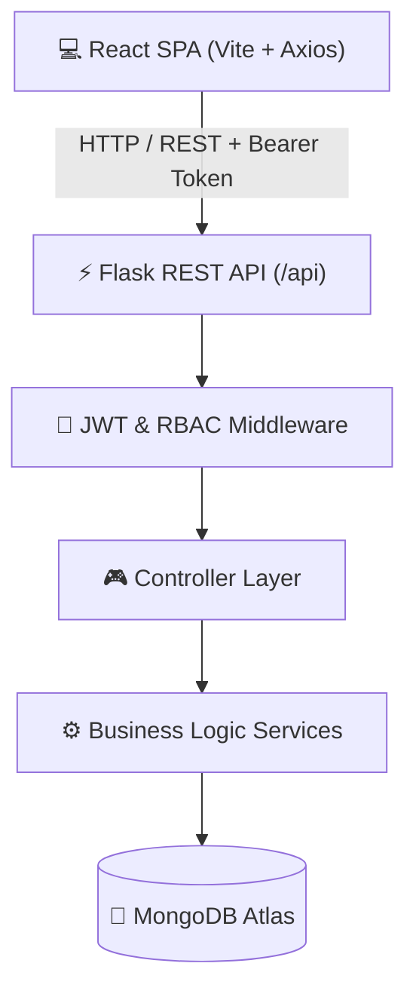

# 🎓 Hostel Gatepass Management System

A production-ready, full-stack digital solution for hostel gatepass management built with **Flask**, **PyMongo (MongoDB Atlas)**, **JWT Authentication**, **Role-Based Access Control (RBAC)**, and a **React + Vite** Single Page Application.

---

## 🌟 Features

### 🔐 Authentication & Authorization
- **Role-Based Access Control (RBAC)**: Distinct permissions for `Student`, `Warden`, and `Admin`.
- **JWT Authentication**: Token-based authentication with Bcrypt password hashing.
- **Session Security**: Security headers (`X-Frame-Options`, `X-XSS-Protection`, `HSTS`, `NOSNIFF`), CORS control, and input validation.

### 📋 Student Gatepass Portal
- **Apply for Gatepass**: Real-time date validation (return date must succeed leave date), destination, and reason.
- **Gatepass Tracking**: Live status tracking (`Pending`, `Approved`, `Rejected`, `Cancelled`).
- **Cancellation**: Self-service cancellation of pending requests.
- **Search & Filters**: Instant search by destination or reason.

### 🛡️ Warden Approval Dashboard
- **Review Requests**: View student details, room numbers, leave duration, and reasons.
- **Approve/Reject**: Instant decision actions with optional warden remarks/instructions.
- **Filter**: Filter by status (`Pending`, `Approved`, `Rejected`).

### 👑 Admin Control Center
- **System Metrics**: Total students, wardens, pending, approved, and rejected gatepasses.
- **User Management**: View user accounts, change user roles dynamically, and remove users.
- **Hostel Management**: Add hostels, assign wardens, and set room capacity.

---

## 📐 Architecture Diagram



---

## 📁 Repository Structure

```
HostelGatepassManagementSystem/
├── backend/
│   ├── app.py                      # Application entry point
│   ├── requirements.txt            # Backend dependencies
│   ├── .env.example                # Environment configuration template
│   ├── README.md                   # Backend documentation
│   ├── config/                     # Database & settings config
│   │   ├── database.py
│   │   └── settings.py
│   ├── controllers/                # Request & response controllers
│   │   ├── admin_controller.py
│   │   ├── auth_controller.py
│   │   ├── gatepass_controller.py
│   │   └── student_controller.py
│   ├── middleware/                 # Auth & role security decorators
│   │   ├── auth.py
│   │   ├── error_handler.py
│   │   └── roles.py
│   ├── models/                     # Mongo schema data helpers
│   │   ├── gatepass.py
│   │   ├── hostel.py
│   │   ├── student.py
│   │   └── user.py
│   ├── routes/                     # Flask API Blueprints
│   │   ├── admin_routes.py
│   │   ├── auth_routes.py
│   │   ├── gatepass_routes.py
│   │   └── student_routes.py
│   ├── services/                   # Core business logic
│   │   ├── auth_service.py
│   │   └── gatepass_service.py
│   ├── utils/                      # Response, validation & helper utils
│   │   ├── helpers.py
│   │   ├── response.py
│   │   └── validators.py
│   └── tests/                      # Pytest unit & integration tests
│       ├── test_admin.py
│       ├── test_auth.py
│       ├── test_gatepass.py
│       └── test_student.py
│
└── frontend/
    ├── package.json                # Frontend dependencies
    ├── vite.config.js              # Vite server & proxy configuration
    ├── .env.example                # Frontend environment template
    └── src/
        ├── api/
        │   └── axiosClient.js      # Centralized Axios with JWT interceptors
        ├── components/             # Reusable UI components
        │   ├── GatepassCard.jsx
        │   ├── Navbar.jsx
        │   ├── ProtectedRoute.jsx
        │   ├── StatCard.jsx
        │   └── Toast.jsx
        ├── context/
        │   └── AuthContext.jsx     # Global JWT Auth State
        ├── pages/                  # Page views
        │   ├── AdminDashboard.jsx
        │   ├── Login.jsx
        │   ├── NotFound.jsx
        │   ├── Profile.jsx
        │   ├── StudentDashboard.jsx
        │   └── WardenDashboard.jsx
        ├── App.jsx
        ├── index.css
        └── main.jsx
```

---

## 🛠️ Installation & Setup

### Prerequisites
- Python 3.10+
- Node.js 18+
- MongoDB Atlas cluster or local MongoDB instance

### 1. Backend Setup

```bash
cd backend

# Install Python dependencies
pip install -r requirements.txt

# Create .env from template
cp .env.example .env

# Edit .env and supply your MongoDB Atlas URI
# MONGO_URI=mongodb+srv://<username>:<password>@cluster.mongodb.net/hostel_gatepass

# Run Backend API (Default: http://localhost:5000)
python app.py
```

### 2. Run Backend Tests

```bash
python -m pytest backend/tests
```

### 3. Frontend Setup

```bash
cd frontend

# Install Node dependencies
npm install

# Create .env from template
cp .env.example .env

# Start Development Server (Default: http://localhost:3000)
npm run dev
```

---

## 🔐 Environment Variables

### Backend (`backend/.env`)
| Variable | Default Value | Description |
| :--- | :--- | :--- |
| `PORT` | `5000` | Port for Flask API server |
| `MONGO_URI` | `mongodb://localhost:27017/hostel_gatepass` | MongoDB Atlas Connection String |
| `JWT_SECRET` | `secret` | Secret key used to sign JWT tokens |
| `SECRET_KEY` | `secret` | Flask session secret key |
| `JWT_EXPIRE_DAYS` | `7` | Token expiration duration |
| `ENVIRONMENT` | `development` | Environment mode (`development` / `production`) |

### Frontend (`frontend/.env`)
| Variable | Default Value | Description |
| :--- | :--- | :--- |
| `VITE_API_URL` | `http://localhost:5000/api` | Base URL for backend REST API |

---

## 📑 API Endpoint Documentation

All response payloads adhere to the standard envelope:
- **Success Response**: `{"success": true, "message": "...", "data": {...}}`
- **Error Response**: `{"success": false, "message": "...", "errors": [...]}`

### Authentication Endpoints (`/api/auth`)

#### `POST /api/auth/register`
- **Auth**: None
- **Payload**:
  ```json
  {
    "fullName": "Arjun Kumar",
    "email": "arjun@student.edu",
    "password": "password123",
    "role": "Student",
    "hostel": "Block A",
    "roomNumber": "101",
    "phone": "9876543210"
  }
  ```
- **Response (201 Created)**:
  ```json
  {
    "success": true,
    "message": "Registration successful",
    "data": {
      "user": { "id": "669...", "fullName": "Arjun Kumar", "email": "arjun@student.edu", "role": "Student" },
      "token": "eyJhbG..."
    }
  }
  ```

#### `POST /api/auth/login`
- **Auth**: None
- **Payload**:
  ```json
  {
    "email": "arjun@student.edu",
    "password": "password123"
  }
  ```

#### `GET /api/auth/me`
- **Auth**: Bearer Token
- **Response (200 OK)**: Current user document without password hash.

---

### Gatepass Endpoints (`/api/gatepass`)

#### `POST /api/gatepass/apply`
- **Auth**: Bearer Token (`Student` role required)
- **Payload**:
  ```json
  {
    "destination": "New Delhi",
    "reason": "Family Visit",
    "leaveDate": "2026-08-01T10:00:00Z",
    "returnDate": "2026-08-05T18:00:00Z"
  }
  ```

#### `PUT /api/gatepass/<id>/approve`
- **Auth**: Bearer Token (`Warden` or `Admin` role required)
- **Payload**:
  ```json
  {
    "remarks": "Approved. Return before 8 PM."
  }
  ```

#### `PUT /api/gatepass/<id>/reject`
- **Auth**: Bearer Token (`Warden` or `Admin` role required)

#### `PUT /api/gatepass/<id>/cancel`
- **Auth**: Bearer Token (`Student` role required)

---

### Admin Endpoints (`/api/admin`)

#### `GET /api/admin/stats`
- **Auth**: Bearer Token (`Admin` or `Warden`)

#### `GET /api/admin/users`
- **Auth**: Bearer Token (`Admin`)

#### `PUT /api/admin/users/<user_id>/role`
- **Auth**: Bearer Token (`Admin`)
- **Payload**: `{"role": "Warden"}`

---

## 🚀 Deployment Guide

### 1. MongoDB Atlas Setup
1. Create a free cluster on [MongoDB Atlas](https://www.mongodb.com/cloud/atlas).
2. Create a Database User with read/write credentials.
3. Allow access from anywhere (`0.0.0.0/0`) in Network Access settings.
4. Obtain connection string and paste into `MONGO_URI`.

### 2. Backend Deployment (Render / Railway)
1. Push repository to GitHub.
2. Create a Web Service on Render / Railway pointing to `backend/`.
3. Set Build Command: `pip install -r requirements.txt`
4. Set Start Command: `gunicorn app:app`
5. Configure Environment Variables (`MONGO_URI`, `JWT_SECRET`, `SECRET_KEY`, `ENVIRONMENT=production`).

### 3. Frontend Deployment (Vercel)
1. Import repository in Vercel.
2. Set Root Directory to `frontend/`.
3. Set Build Command: `npm run build`
4. Set Output Directory: `dist`
5. Configure Environment Variable: `VITE_API_URL=https://your-backend-api.onrender.com/api`

---

## ❓ Troubleshooting & Common Errors

1. **`MONGO_URI` connection timeout**:
   - Ensure your IP address is whitelisted on MongoDB Atlas Network Access.
   - Verify connection string credentials.

2. **CORS issues during local testing**:
   - Ensure backend is running on `http://localhost:5000` and frontend on `http://localhost:3000`.
   - Verify Vite proxy settings in `vite.config.js`.

3. **`401 Unauthorized` token error**:
   - Verify that your token has not expired (`JWT_EXPIRE_DAYS=7`).
   - Check that the `Authorization: Bearer <token>` header is sent with API calls.
